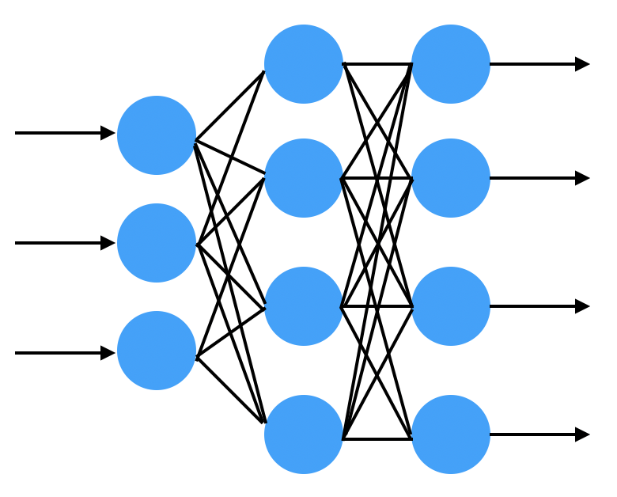

# 数据科学导论 实验报告

## 一、队伍信息

赛题：乘用车细分市场销量预测

队名：写代码像蔡徐坤

| 姓名 | 学号 | 分工 |
| :---: | :--------: | :-----------------: |
| 金哲欣 | PB17111663 | 多层感知机、协同过滤、长尾效应、规则、融合、可视化分析 |
| 许世晨 | PB17030846 | 数据预处理、残差神经网络、DFM、CNN、LSTM、SVM |
| 李纯羽 | PB17111618 | LGB模型、特征工程、数据预处理 |

## 二、比赛成果

* A榜：第 196 名（正赛）

* B榜：第 145 名（本赛题下排名最靠前的科大队伍）

* 自主实现了MLP、协同过滤、DFM、CNN、LSTM、SVM等模型，其中MLP的输出结果经过长尾处理之后，得到的分数超过了当时所有开源的 Baseline ，对已开源的 Baseline 模型，包括LGB、XGB、规则模型进行学习和改进，并受其启发，改进自主实现的模型。

## 三、进展概要

## 四、模型介绍

### 1. 多层感知机 MLP

#### 1.1 朴素的多层感知机

##### 概念介绍

​		全连接层是最简单的神经网络结构之一，它的每个神经元都与上一层的所有神经元相连接。许多全连接层首尾相连，便构成了一个多层感知机，我们称第一层为输入层，最后一层为输出层，中间的层都称为隐藏层。下图是一个输入纬度是3，输出维度是4，隐藏层神经元个数为4的全连接神经网络：



​		神经网络可以视作一个函数，接收输入x，获得输出y，通过训练集中真实的y与神经网络输出的y进行对比，使用反向传播算法修正神经网络所代表的函数，最终拟合出一个接近真实的函数。

##### 数据划分

​		由于我们获得的训练集仅仅只有两个年，所以如果仅拿上一年的1～12月预测下一年的1～4月，那么下一年的5～12月的数据就无法被利用，这不利于神经网络的训练。

​		所以我们决定使用前12个月预测后4个月的方法，比如用2016.1～2016.12的数据预测2017.1～2017.4，用2016.2～2017.1的数据预测2017.2～2017.6。这样做既可以在一定程度上保留一年12个月的周期性特征，也大大增加了训练数据的条目数。

​		此外，我们还对数据的划分进行了其他尝试，比如：输入前8个月输出后4个月、输入前6个月输出后4个月、输入前4个月输出后4个月等。

##### 模型实现

​		我们使用 Tensorflow 搭建了一个4层的神经网络，隐藏层神经元个数为32，每层输出都经过一个 Sigmoid 激活函数，并使用正态分布初始化权重。

```python
model = keras.Sequential([
    layers.Dense(32, activation='sigmoid', kernel_initializer='he_normal', input_shape=(x_train.shape[1], )),
    layers.Dense(32, activation='sigmoid', kernel_initializer='he_normal'),
    layers.Dense(32, activation='sigmoid', kernel_initializer='he_normal'),
    layers.Dense(4)
])
```

##### 结果分析

​		最终的训练结果不尽人意，分数大概在0.3～0.4左右，远远低于开源的 baseline 的水平。

​		在多种数据划分的尝试中，我们发现使用前4个月预测后4个月的效果最佳。这使我们感到诧异，因为使用前4个月预测后4个月，意味着我们放弃了数据中潜在的周期性规律，仅仅寄希望于拟合前4个月销量对后4个月销量的影响。我们认为这种差异有可能是数据量的不同造成的，因为如果使用前12个月预测后4个月，我们对某个车型某个省份只能分割出8个数据条目，总共 $8 \times 22 \times 60 = 10560$ 个数据条目；然而，如果使用前4个月预测后4个月，我们对某个车型某个省份只能分割出16个数据条目，总共 $16 \times 22 \times 60 = 21120$ 个数据条目。

​		我们将该模型的结果与我们目前得到的最优结果进行可视化对比：（蓝线为最优结果，黄线为当前模型）


​		可以看到在某些车型上，朴素多层感知机的预测结果与最优结果相去甚远。

#### 1.2 残差神经网络 ResNet

##### 概念介绍

​		残差网络是由来自Microsoft Research的4位学者提出的卷积神经网络，在2015年的ImageNet大规模视觉识别竞赛（ImageNet Large Scale Visual Recognition Challenge, ILSVRC）中获得了图像分类和物体识别的优胜。 残差网络的特点是容易优化，并且能够通过增加相当的深度来提高准确率。其内部的残差块使用了跳跃连接，缓解了在深度神经网络中增加深度带来的梯度消失问题。


​		残差神经网络的结构如上图所示，可以看出，残差神经网络与普通神经网络的区别在于，残差神经网络比普通神经网络多了一个将浅层的x与深层的F(x)相加并输出到下一层网络。

​		令x表示输入，F(x)表示残差块在第二层激活函数之前的输出，即 $F(x)=W_2σ(W_1x)$，其中$W_1$和$W_2$表示第一层和第二层的权重，$\sigma$ 表示 ReLU 激活函数。（这里省略了bias），最后残差块的输出是 $\sigma(F(x)+x)$。

　　当没有 shortcut connection（即图中右侧从 x 到 ⨁ 的箭头）时，残差块就是一个普通的 2 层网络。残差块中的网络可以是全连接层，也可以是卷积层。设第二层网络在激活函数之前的输出为 H(x)。如果在该 2 层网络中，最优的输出就是输入 x，那么对于没有 shortcut connection 的网络，就需要将其优化成 $H(x)=x$；对于有 shortcut connection 的网络，即残差块，如果最优输出是 x，则只需要将 $F(x)=H(x)−x$ 优化为 0 即可。后者的优化会比前者简单。这也是残差这一叫法的由来。

​		残差神经网络也有很多变体，比如下图所示的6种变体：


##### 数据划分

​		根据朴素多层感知机的结果和分析，由前4个月预测后4个月的结果效果最好可能是由于数据量引起的，加上了残差神经网络之后，优化被简化了，为了保留周期性的规律，我们决定使用前12个月预测后12个月。这从某种程度上默认了一个假设：2016年到2017年的变化与2017年到2018年的变化相同。事实上经过实际的测试，这种假设确实有它存在的合理性。当然，我们也进行了其他数据划分方式的测试，效果都不如使用前12个月预测后12个月的划分方式。

##### 模型实现

​		我们在朴素多层感知机的基础上，增加了残差神经网络，并将每层的神经元个数做了相应的修改，以适应残差神经网络的连接层。同时我们也测试了不同的连接方式：相加、相乘、合并等。

```python
input = layers.Input(shape=(input_dim, ))
dense = layers.Dense(36, activation='sigmoid', kernel_initializer='he_normal')(input)
dense = layers.Dense(input_dim, kernel_initializer='he_normal')(dense)
dense = layers.Add()([input, dense])
dense = layers.Activation('sigmoid')(dense)
dense = layers.Dense(36, activation='sigmoid', kernel_initializer='he_normal')(dense)
output = layers.Dense(output_dim)(dense)
model = keras.Model(input, output)
model.compile(keras.optimizers.Adam(1e-2), loss=keras.losses.mse)
```

##### 结果分析

​		我们将该模型的结果与我们目前得到的最优结果进行可视化对比：（蓝线为最优结果，黄线为当前模型）


​		前两张图对应的模型刚好是朴素多层感知机中预测结果不好的两个模型，可见残差神经网络对于效果的提升非常巨大。残差神经网络的模型最终的得分在0.45～0.53之间，这个结果已经基本与开源的基于规则的模型持平。

​		后两张图展示的是残差神经网络预测结果相对不准的情况。经过观察和分析，我们发现这些预测不准确的情况都是由于周期性不明显（部分月份周期不规则）导致的。

#### 1.3 平稳化处理

##### 概念介绍

​		时间序列的预处理，一方面能够使序列的特征体现得更加明显，利于分析模型的选择；另一方面也使数据满足模型的要求。时间序列往往具有明显的长期趋势和不规则变动叠加于随机波动之上，因此，大部分时间序列都是非平稳的时间序列。

##### 模型实现

​		由于数据集中只存在两年的销量数据，又由于该时间序列以12个月为周期，金融领域数据分析中常用的平稳化方法一阶差分、二阶差分无法应用在这里，因为会丢失第一个月的差分数据，而缺少这个数据将导致我们无法进行预测。

​		这里我们有一个假设，即汽车的销量是存在一个线性增加或线性减少的趋势，并且，每连续的12个月的销量的平均值是稳定的，可以一定程度上反映这个线性的趋势。

​		我们分别计算每连续12个月的平均值，然后使用最小二乘法拟合这个线性趋势，最终对每个车型每个省份减去这个趋势，再将平稳化之后的数据放入神经网络中进行训练拟合。

​		下图为12个月的滑窗平均值（黄线）和最小二乘法拟合的趋势（绿线）：（蓝线为销量）


##### 结果分析

​		我们将平稳化处理的模型结果（绿线）和没有平稳化处理的结果（黄线）对比：（蓝线为我们得到的最优结果）


​		可以看到，绿线更加接近蓝线，并且更加符合理想当中的情况。

​		但是，我们仍然能够观察到一部分有待提升的情况：（黄线为本模型，蓝线为最优结果）


​		由上图，我们可以观察到，进行平稳化处理之后的模型确实学习到了平移的特性，但是我们会发现，如果只是单纯的平移，会使所得的结果偏小。同时，回想以上模型对小于0的值的处理，仅仅只是把小于0的值纠正为0，然而事实上，如果仅把小于0的值增大到0显然对其他略大于0的值不公平，需要有一种统一的方法，把四个月的预测值限制在某个合理的范围内。我们意识到，销量数据在接近0的时候，会逐渐趋于平稳。或者说，这可能是由于长尾效应引起的，12个月的滑窗平均值的趋势并不是我们之前所假设的线性趋势，而是一种长尾趋势。

#### 1.4 长尾效应处理

##### 概念介绍

​		“头”和“尾”是两个统计学名词。正态曲线中间的突起部分叫“头”；两边相对平缓的部分叫“尾”。从人们需求的角度来看，大多数的需求会集中在头部，而这部分我们可以称之为流行，而分布在尾部的需求是个性化的，零散的小量的需求。而这部分差异化的、少量的需求会在需求曲线上面形成一条长长的“尾巴”，而所谓长尾效应就在于它的数量上，将所有非流行的市场累加起来就会形成一个比流行市场还大的市场。

​		在时间序列模型中，长尾效应通常用于把时间序列拟合为幂律分布或者其他具有“长尾”性质的分布，常见的方法是对横纵坐标取对数，将其转换为近似的线性关系。

##### 模型实现

​		对于处理长尾效应我们尝试了以下几种方法：

		1. 把横纵坐标取对数，拟合线性趋势，原数据减去线性趋势，然后放入神经网络中进行训练，最终结果进行反变换还原。
  		2. 把销量数据的12个月滑窗平均值拟合成幂律分布/指数分布/正态分布，原销量减去该趋势之后，放入神经网络进行训练，得到结果后再加上该趋势。
  		3. 把销量数据的12个月滑窗平均值拟合成线性趋势，原销量减去线性趋势之后，放入神经网络进行训练，最终结果使用长尾分布进行修正。

​        最终，经过多次测试，我们决定使用第三种方法。修正时，使用指数分布 $y=A*\lambda*e^{-\lambda(x+B)}$ 来拟合12个月滑窗平均值，并且将其上下平移一定距离（距离可以由四分位数或者最大、最小值来确定），使其成为预测结果的上下界，如果预测结果超出上下界，则以中间的拟合值为中心，对预测结果进行缩放，使其落在上下界之内。

​		由于指数分布只适用于下降的趋势，对于上升的趋势，我们使用函数 $y=A*(x+1)^{1/\lambda}$ 来拟合增长的12个月滑窗平均值，其中 $\lambda > 1$ 。

​		对于接近稳定的趋势（斜率约等于0），我们使用线性函数来拟合趋势。

​		示意图如下：（蓝线为销量，黄线为12个月滑窗平均值的拟合曲线，红线为上限，绿线为下限）


##### 结果分析

​		经过长尾处理之后的结果如下：（蓝线为最优结果，绿线为本模型，黄线为未经长尾处理的结果）


​		可以看到，经过长尾处理之后的结果，更加接近最优结果，其得分大概在0.56～0.57左右，基本赶超了目前已经开源的 LGB 和 XGB 模型。

### 2. 协同过滤

### 3. DFM

### 4. LSTM

### 5. LGB

### 6. 模型融合

## 五、心得体会

## 六、参考文献

