# 数据科学导论 实验报告


## 一、队伍信息

赛题：乘用车细分市场销量预测

队名：写代码像蔡徐坤

指导教师：刘淇

成员：

| 姓名 | 学号 | 分工 |
| :---: | :--------: | :-----------------: |
| 金哲欣 | PB17111663 | 多层感知机、协同过滤、长尾效应、规则、融合、可视化分析 |
| 许世晨 | PB17030846 | 数据预处理、残差神经网络、DFM、CNN、LSTM、SVR |
| 李纯羽 | PB17111618 | LGB模型、特征工程、数据预处理 |


## 二、比赛成果


* A榜：第 196 名（正赛）
* B榜：第 145 名（本赛题下排名最靠前的科大队伍）
* A榜：第 6 名（训练赛，截至 2019.12.8）
* 自主实现了MLP、协同过滤、DFM、CNN、LSTM、SVR等模型，其中MLP的输出结果经过长尾处理之后，得到的分数超过了当时所有开源的 Baseline ，对已开源的 Baseline 模型，包括LGB、XGB、规则模型进行学习和改进，并受其启发，改进自主实现的模型。

> 在 [https://www.datafountain.cn/special/BDCI2019/talent](https://www.datafountain.cn/special/BDCI2019/talent) 中可以看到队伍的排名以及队伍所属的学校。


## 三、模型介绍

### 1. 多层感知机 MLP

#### 1.1 朴素的多层感知机

##### 概念介绍

​		全连接层是最简单的神经网络结构之一，它的每个神经元都与上一层的所有神经元相连接。许多全连接层首尾相连，便构成了一个多层感知机，我们称第一层为输入层，最后一层为输出层，中间的层都称为隐藏层。下图是一个输入纬度是3，输出维度是4，隐藏层神经元个数为4的全连接神经网络：


​		神经网络可以视作一个函数，接收输入x，获得输出y，通过训练集中真实的y与神经网络输出的y进行对比，使用反向传播算法修正神经网络所代表的函数，最终拟合出一个接近真实的函数。

##### 数据划分

​		由于我们获得的训练集仅仅只有两个年，所以如果仅拿上一年的1～12月预测下一年的1～4月，那么下一年的5～12月的数据就无法被利用，这不利于神经网络的训练。

​		所以我们决定使用前12个月预测后4个月的方法，比如用2016.1～2016.12的数据预测2017.1～2017.4，用2016.2～2017.1的数据预测2017.2～2017.6。这样做既可以在一定程度上保留一年12个月的周期性特征，也大大增加了训练数据的条目数。

​		此外，我们还对数据的划分进行了其他尝试，比如：输入前8个月输出后4个月、输入前6个月输出后4个月、输入前4个月输出后4个月等。

##### 模型实现

​		我们使用 Tensorflow 搭建了一个4层的神经网络，隐藏层神经元个数为32，每层输出都经过一个 Sigmoid 激活函数，并使用正态分布初始化权重。

```python
model = keras.Sequential([
    layers.Dense(32, activation='sigmoid', kernel_initializer='he_normal', input_shape=(x_train.shape[1], )),
    layers.Dense(32, activation='sigmoid', kernel_initializer='he_normal'),
    layers.Dense(32, activation='sigmoid', kernel_initializer='he_normal'),
    layers.Dense(4)
])
```

##### 结果分析

​		最终的训练结果不尽人意，分数大概在0.3～0.4左右，远远低于开源的 baseline 的水平。

​		在多种数据划分的尝试中，我们发现使用前4个月预测后4个月的效果最佳。这使我们感到诧异，因为使用前4个月预测后4个月，意味着我们放弃了数据中潜在的周期性规律，仅仅寄希望于拟合前4个月销量对后4个月销量的影响。我们认为这种差异有可能是数据量的不同造成的，因为如果使用前12个月预测后4个月，我们对某个车型某个省份只能分割出8个数据条目，总共 $8 \times 22 \times 60 = 10560$ 个数据条目；然而，如果使用前4个月预测后4个月，我们对某个车型某个省份只能分割出16个数据条目，总共 $16 \times 22 \times 60 = 21120$ 个数据条目。

​		我们将该模型的结果与我们目前得到的最优结果进行可视化对比：（蓝线为最优结果，黄线为当前模型）

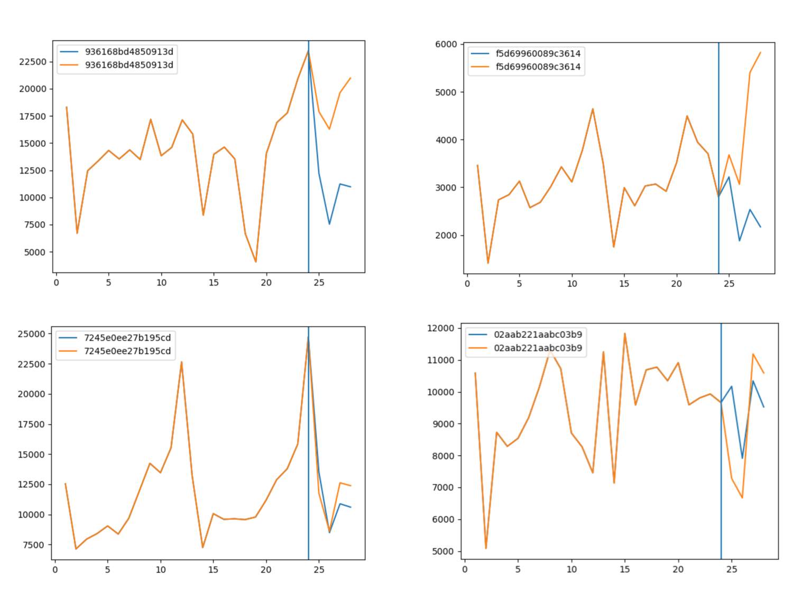

​		可以看到在某些车型上，朴素多层感知机的预测结果与最优结果相去甚远。

#### 1.2 残差神经网络 ResNet

##### 概念介绍

​		残差网络是由来自Microsoft Research的4位学者提出的卷积神经网络，在2015年的ImageNet大规模视觉识别竞赛（ImageNet Large Scale Visual Recognition Challenge, ILSVRC）中获得了图像分类和物体识别的优胜。 残差网络的特点是容易优化，并且能够通过增加相当的深度来提高准确率。其内部的残差块使用了跳跃连接，缓解了在深度神经网络中增加深度带来的梯度消失问题。

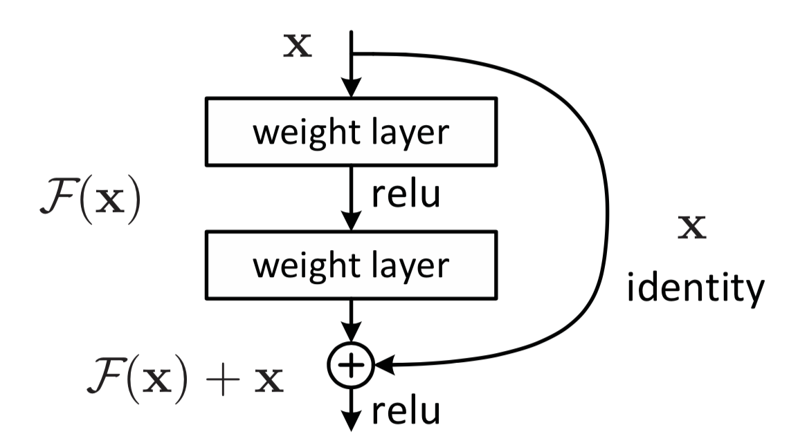

​		残差神经网络的结构如上图所示，可以看出，残差神经网络与普通神经网络的区别在于，残差神经网络比普通神经网络多了一个将浅层的x与深层的F(x)相加并输出到下一层网络。

​		令x表示输入，F(x)表示残差块在第二层激活函数之前的输出，即 $F(x)=W_2σ(W_1x)$，其中$W_1$和$W_2$表示第一层和第二层的权重，$\sigma$ 表示 ReLU 激活函数。（这里省略了bias），最后残差块的输出是 $\sigma(F(x)+x)$。

　　当没有 shortcut connection（即图中右侧从 x 到 ⨁ 的箭头）时，残差块就是一个普通的 2 层网络。残差块中的网络可以是全连接层，也可以是卷积层。设第二层网络在激活函数之前的输出为 H(x)。如果在该 2 层网络中，最优的输出就是输入 x，那么对于没有 shortcut connection 的网络，就需要将其优化成 $H(x)=x$；对于有 shortcut connection 的网络，即残差块，如果最优输出是 x，则只需要将 $F(x)=H(x)−x$ 优化为 0 即可。后者的优化会比前者简单。这也是残差这一叫法的由来。

​		残差神经网络也有很多变体，比如下图所示的6种变体：

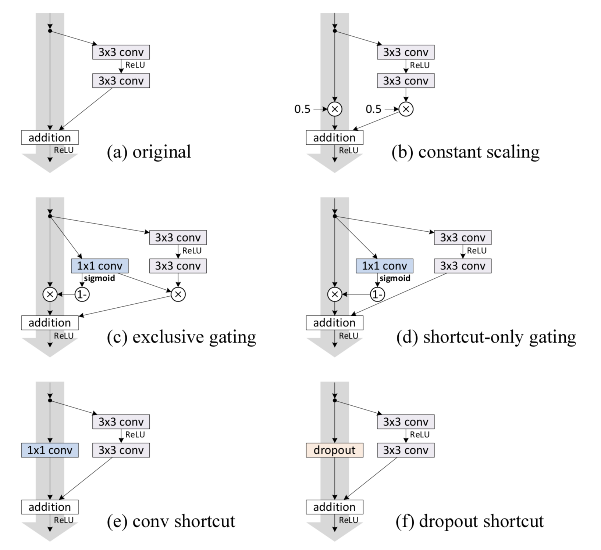

##### 数据划分

​		根据朴素多层感知机的结果和分析，由前4个月预测后4个月的结果效果最好可能是由于数据量引起的，加上了残差神经网络之后，优化被简化了，为了保留周期性的规律，我们决定使用前12个月预测后12个月。这从某种程度上默认了一个假设：2016年到2017年的变化与2017年到2018年的变化相同。事实上经过实际的测试，这种假设确实有它存在的合理性。当然，我们也进行了其他数据划分方式的测试，效果都不如使用前12个月预测后12个月的划分方式。

##### 模型实现

​		我们在朴素多层感知机的基础上，增加了残差神经网络，并将每层的神经元个数做了相应的修改，以适应残差神经网络的连接层。同时我们也测试了不同的连接方式：相加、相乘、合并等。

```python
input = layers.Input(shape=(input_dim, ))
dense = layers.Dense(36, activation='sigmoid', kernel_initializer='he_normal')(input)
dense = layers.Dense(input_dim, kernel_initializer='he_normal')(dense)
dense = layers.Add()([input, dense])
dense = layers.Activation('sigmoid')(dense)
dense = layers.Dense(36, activation='sigmoid', kernel_initializer='he_normal')(dense)
output = layers.Dense(output_dim)(dense)
model = keras.Model(input, output)
model.compile(keras.optimizers.Adam(1e-2), loss=keras.losses.mse)
```

##### 结果分析

​		我们将该模型的结果与我们目前得到的最优结果进行可视化对比：（蓝线为最优结果，黄线为当前模型）

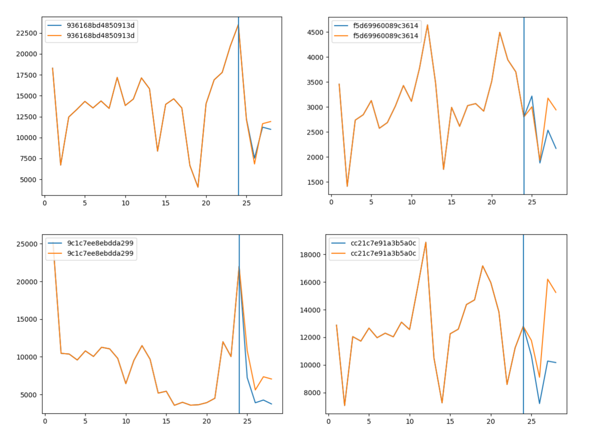

​		前两张图对应的模型刚好是朴素多层感知机中预测结果不好的两个模型，可见残差神经网络对于效果的提升非常巨大。残差神经网络的模型最终的得分在0.45～0.53之间，这个结果已经基本与开源的基于规则的模型持平。

​		后两张图展示的是残差神经网络预测结果相对不准的情况。经过观察和分析，我们发现这些预测不准确的情况都是由于周期性不明显（部分月份周期不规则）导致的。

#### 1.3 平稳化处理

##### 概念介绍

​		时间序列的预处理，一方面能够使序列的特征体现得更加明显，利于分析模型的选择；另一方面也使数据满足模型的要求。时间序列往往具有明显的长期趋势和不规则变动叠加于随机波动之上，因此，大部分时间序列都是非平稳的时间序列。

##### 模型实现

​		由于数据集中只存在两年的销量数据，又由于该时间序列以12个月为周期，金融领域数据分析中常用的平稳化方法一阶差分、二阶差分无法应用在这里，因为会丢失第一个月的差分数据，而缺少这个数据将导致我们无法进行预测。

​		这里我们有一个假设，即汽车的销量是存在一个线性增加或线性减少的趋势，并且，每连续的12个月的销量的平均值是稳定的，可以一定程度上反映这个线性的趋势。

​		我们分别计算每连续12个月的平均值，然后使用最小二乘法拟合这个线性趋势，最终对每个车型每个省份减去这个趋势，再将平稳化之后的数据放入神经网络中进行训练拟合。

​		下图为12个月的滑窗平均值（黄线）和最小二乘法拟合的趋势（绿线）：（蓝线为销量）

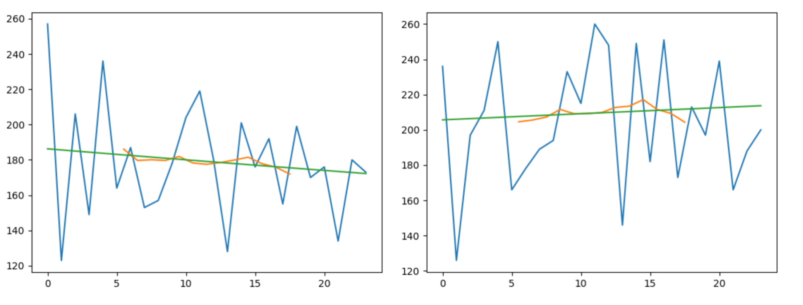

##### 结果分析

​		我们将平稳化处理的模型结果（绿线）和没有平稳化处理的结果（黄线）对比：（蓝线为我们得到的最优结果）

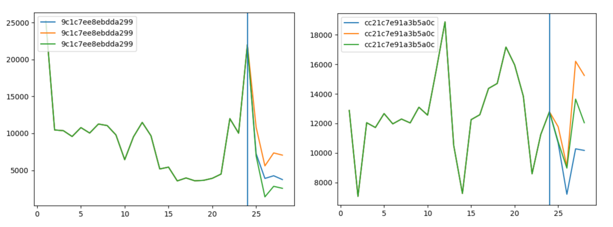

​		可以看到，绿线更加接近蓝线，并且更加符合理想当中的情况。

​		但是，我们仍然能够观察到一部分有待提升的情况：（黄线为本模型，蓝线为最优结果）

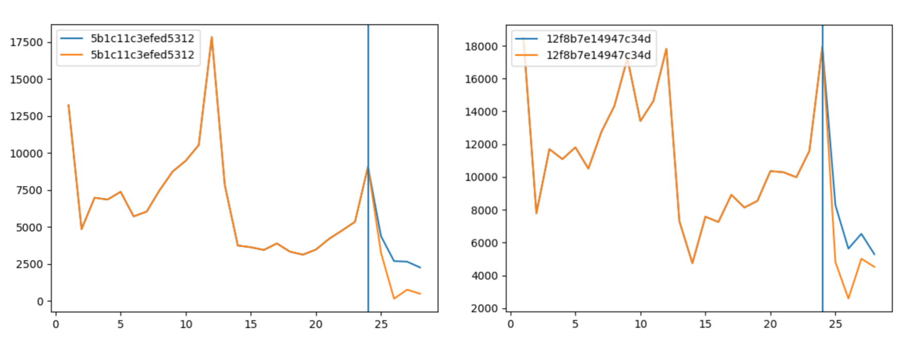

​		由上图，我们可以观察到，进行平稳化处理之后的模型确实学习到了平移的特性，但是我们会发现，如果只是单纯的平移，会使所得的结果偏小。同时，回想以上模型对小于0的值的处理，仅仅只是把小于0的值纠正为0，然而事实上，如果仅把小于0的值增大到0显然对其他略大于0的值不公平，需要有一种统一的方法，把四个月的预测值限制在某个合理的范围内。我们意识到，销量数据在接近0的时候，会逐渐趋于平稳。或者说，这可能是由于长尾效应引起的，12个月的滑窗平均值的趋势并不是我们之前所假设的线性趋势，而是一种长尾趋势。

#### 1.4 长尾效应处理

##### 概念介绍

​		“头”和“尾”是两个统计学名词。正态曲线中间的突起部分叫“头”；两边相对平缓的部分叫“尾”。从人们需求的角度来看，大多数的需求会集中在头部，而这部分我们可以称之为流行，而分布在尾部的需求是个性化的，零散的小量的需求。而这部分差异化的、少量的需求会在需求曲线上面形成一条长长的“尾巴”，而所谓长尾效应就在于它的数量上，将所有非流行的市场累加起来就会形成一个比流行市场还大的市场。

​		在时间序列模型中，长尾效应通常用于把时间序列拟合为幂律分布或者其他具有“长尾”性质的分布，常见的方法是对横纵坐标取对数，将其转换为近似的线性关系。

##### 模型实现

​		对于处理长尾效应我们尝试了以下几种方法：

1. 把横纵坐标取对数，拟合线性趋势，原数据减去线性趋势，然后放入神经网络中进行训练，最终结果进行反变换还原。

  		2. 把销量数据的12个月滑窗平均值拟合成幂律分布/指数分布/正态分布，原销量减去该趋势之后，放入神经网络进行训练，得到结果后再加上该趋势。
  		3. 把销量数据的12个月滑窗平均值拟合成线性趋势，原销量减去线性趋势之后，放入神经网络进行训练，最终结果使用长尾分布进行修正。

​        最终，经过多次测试，我们决定使用第三种方法。修正时，使用指数分布 $y=A*\lambda*e^{-\lambda(x+B)}$ 来拟合12个月滑窗平均值，并且将其上下平移一定距离（距离可以由四分位数或者最大、最小值来确定），使其成为预测结果的上下界，如果预测结果超出上下界，则以中间的拟合值为中心，对预测结果进行缩放，使其落在上下界之内。

​		由于指数分布只适用于下降的趋势，对于上升的趋势，我们使用函数 $y=A*(x+1)^{1/\lambda}$ 来拟合增长的12个月滑窗平均值，其中 $\lambda > 1$ 。

​		对于接近稳定的趋势（斜率约等于0），我们使用线性函数来拟合趋势。

​		示意图如下：（蓝线为销量，黄线为12个月滑窗平均值的拟合曲线，红线为上限，绿线为下限）

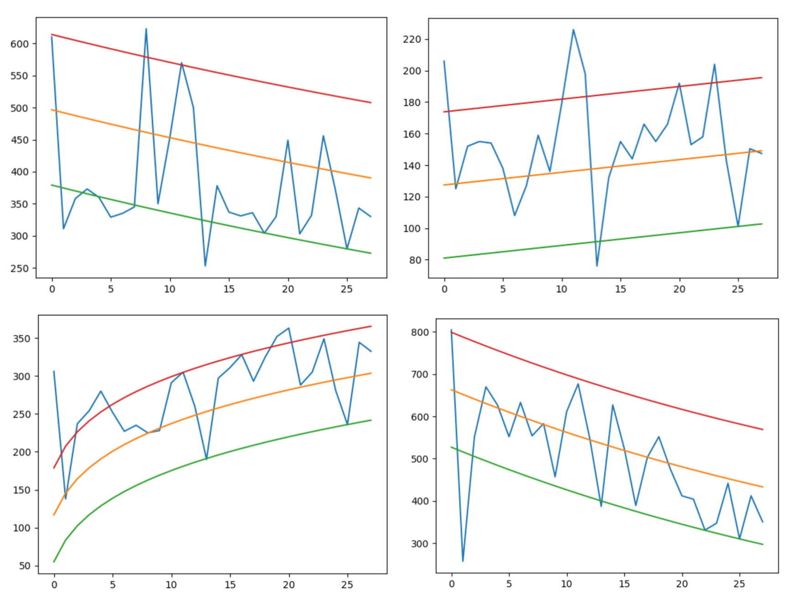

##### 结果分析

​		经过长尾处理之后的结果如下：（蓝线为最优结果，绿线为本模型，黄线为未经长尾处理的结果）

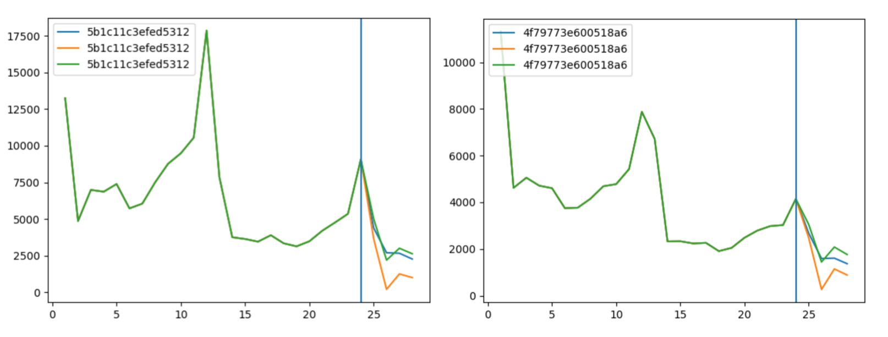

​		可以看到，经过长尾处理之后的结果，更加接近最优结果，其得分大概在0.56～0.57左右，基本赶超了目前已经开源的 LGB 和 XGB 模型。

### 2. 协同过滤

##### 概念介绍

​		协同过滤是利用集体智慧的一个典型方法。要理解什么是协同过滤，首先想一个简单的问题，如果你现在想看个电影，但你不知道具体看哪部，你会怎么做？大部分的人会问问周围的朋友，看看最近有什么好看的电影推荐，而我们一般更倾向于从口味比较类似的朋友那里得到推荐。这就是协同过滤的核心思想。

​		协同过滤一般是在海量的用户中发掘出一小部分和你品位比较类似的，在协同过滤中，这些用户成为邻居，然后根据他们喜欢的其他东西组织成一个排序的目录作为推荐给你。当然其中有一个核心的问题：

* 如何确定一个用户是不是和你有相似的品位？
* 如何将邻居们的喜好组织成一个排序的目录？

​        协同过滤相对于集体智慧而言，它从一定程度上保留了个体的特征，就是你的品位偏好，所以它更多可以作为个性化推荐的算法思想。协同过滤推荐算法是诞生最早，并且较为著名的推荐算法。主要的功能是预测和推荐。算法通过对用户历史行为数据的挖掘发现用户的偏好，基于不同的偏好对用户进行群组划分并推荐品味相似的商品。协同过滤推荐算法分为两类，分别是基于用户的协同过滤算法，和基于物品的协同过滤算法。简单的说就是：人以类聚，物以群分。

##### 模型实现

​		在本模型中，我们把每个省份当作用户，把每种车型当成商品。我们假设类似车型的趋势差不多，那么类似的车型就好像类似的商品；同时，我们也假设有些省份对某种车型的喜好程度差不多，那么类似的省份就好像兴趣相似的消费者。输入省份和车型的One-Hot编码向量，经过一层全连接层，使其变成12维的Embedding稠密向量，然后再经过一层全连接层，再将其相乘，输出为12维的预测，对应12个月的销量。

```python
model = layers.Input(shape=(1, ))
adcode = layers.Input(shape=(1, ))
model_embed = layers.Embedding(60, 12, embeddings_initializer='he_normal')(model)
adcode_embed = layers.Embedding(22, 12, embeddings_initializer='he_normal')(adcode)
model_embed = layers.Flatten()(model_embed)
adcode_embed = layers.Flatten()(adcode_embed)
model_dense = layers.Dense(32, activation='sigmoid', kernel_initializer='he_normal')(model_embed)
adcode_dense = layers.Dense(32, activation='sigmoid', kernel_initializer='he_normal')(adcode_embed)
dense = layers.Mul()([model_dense, adcode_dense])
dense = layers.Dense(32, activation='sigmoid', kernel_initializer='he_normal')(dense)
output = layers.Dense(12)(dense)
model = keras.Model([model, adcode], output)
```

​		同时，我们也把多层感知机中对数据的平稳化和长尾处理加入到这个模型中。

##### 结果分析

​		我们把基于协同过滤的模型（黄线）和最好的结果（蓝线）对比：

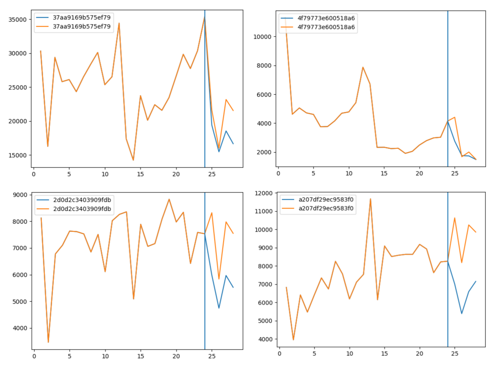

​		可以看到，本模型在周期性比较明显的车型下预测得比较准确，而在周期性不明显、预测更多依赖于前几个月的销量的车型下表现就不佳。我们认为这是由于协同过滤的模型适用于用户喜好稳定、商品受欢迎程度稳定的基础上，然而在本题下，有些省份对车型的偏好并不稳定，车型的流行程度也会随时间变化，所以预测结果相对不准确。

### 3. 另一种全连接网络

​		考虑到有很多数据都是Category的，我一开始是想训练一个end-to-end的模型，输入年份，月份，地区，型号等数据，然后输出预测的销量。我想先尝试一下全连接网络。

​		首先我考虑，对这些Category的数据，我是直接把one-hot向量送进模型，还是加一层embedding呢？我决定都尝试一下。我先试了直接使用one-hot向量的办法。

​		说实话这种办法有些离经叛道，因为我似乎送来没有见过直接把one-hot向量直接加进全连接层的。这样做看起来很没有道理。但我懒得管这么多了，因为做一次这种尝试的成本是很低廉的。

​		在这一版的全连接网络里，输入由Category的数据和Numerical的数据组成。考虑输入
$$
x = \{x_0, \dots, x_l, x_{l+1}, \dots, x_n\}
$$
其中$x_0, \dots, x_l$为one-hot之后的Category数据，比如说, $x_0, x_1, \dots, x_{11}$代表了一项销售数据的月份，假如这个销售数据产生在1月，那么有
$$
x_0 = 1, \\x_1, \dots, x_{11} = 0
$$
 $x_{l+1}, \dots, x_n$为Numerical的数据，也就是说
$$
x_0, \dots, x_l \in \{0, 1\}\\
x_{l+1}, \dots, x_n \in \mathscr{R}
$$
我把这两种数据一视同仁地视为全连接网络的输入，也就是有
$$
h_1 = \sigma_0(W_0x+b_0)\\
\dots\\
h_k = \sigma_{k-1}(W_{k-1}h_{k-1} + b_{k-1})\\
\dots\\
y = \sigma_{n-1}(W_{n-1}h_{n-1} + b_{n-1})
$$
当然，其实这种做法其实是相当悄然地于做了embedding的。Embedding出现在哪里呢？就在一开始：
$$
h_1 = \sigma_0(W_0x+b_0)
$$
目录型数据的embedding其实就隐藏在$W_0$里，这是不难发现的。无论如何，现在开始考虑训练的过程和一些trick。

​		对于训练的过程， 我们输入的当然是需要预测的细分市场的信息， 包括月份， 省份，车型这三个最重要的Category数据。此外，还可以输入对应的省份，车型和月份的评论数量。Category数据embedding之后获得的0-1向量和numerical数据进行拼接，得到了模型的输入向量。模型的输出值当然是一个表示2019年销量预测值的数值。

### 4. CNN

#### 思路

​		为什么会想到使用CNN呢？这基于对销售数据的一个重要的观察，或者说假设。那就是，**对于特定的省份和车型，它在2017年的某月的销量，和它在2016年的这个月及其附近几个月的销量关系是最大的。**

​		例如，我们想要靠2016年的销量数据来预测特定车型在特定省份在2017年5月的销量。我们应该怎么做呢? 假如我们只能从2016年12个月的销售数据中选取一个月的数据来预测2017年5月的销售数据，那么我们一定会选择通过2016年5月的销量数据，因为2016年5月的销量数据对2017年5月的销量影响是最大的。那么如果只能只能从2016年12个月的销售数据中选取两个月的数据来预测2017年5月的销售数据，那么我们一定会选择5月和4月，或者5月和6月。

​		这在直观上是易于理解的。不同的年份中相同的月份，有着类似的特点，如气候，经济形势，节假日情况，甚至消费潮流。 为了预测2017年5月的销量，选取2016年5月及其附近的月份的数据是合适的。

​		那么，也许使用2016年全年的销量数据来预测2017年5月的销量数据的效果是最好的? 其实未必。因为，2016年1月或者2016年12月的销量数据，和2017年5月的销量其实关系已经不是很大了。甚至，它们可能不仅关系不大，还可能对预测起到负面效果。

​		之前提到的MLP模型使用了某一年全年的数据来预测下一年某个月的销售数据，但是在这个模型中，为了预测2018年5月的销售额，2017年5月，4月，以及12月的销量以相同的权重进入模型。显然这些数据的权重是不同的。虽然在模型的第一层，可以训练得到这些数据的不同权重，但训练毕竟有时候是玄学的，因为种种原因可能并不能获得最优解。

​		所以，我们希望能够经过人工的方法，使得在预测5月分的数据时，模型能够专注于3,4,5,6几个月的数据。用attention机制当然可以实现这个目的，但在这之前我们先尝试另外一个方法，那就是一维CNN。

#### 过程

在训练阶段，对于每一个需要预测的月份，我们使用一个一维卷积核。这个卷积核的大小一般是3或5。为了预测4月份的销量，使用一个一维卷积核来提取去年3-5月的销量，也许在经过一些变换，从而得到输出的结果。

在训练过程中，2016年的数据是训练数据，而2017年的数据是ground truth。当然，在预测过程中，2017年的数据被用于预测，而输出的是2018年的数据。

#### 结果

事实证明这是一个非常不错的想法。在未经任何有意识调参的情况下，也就是说，随手一跑，得分就达到了0.5左右。有理由相信经过一段时间的调参时候，这个模型的得分会很不错。

### 5. LSTM

#### 思路

​		时间序列预测问题是一个复杂的预测模型问题，它不像一般的回归预测模型。时间序列预测的输入变量是一组按时间顺序的数字序列。它既具有延续性又具有随机性，所以在建模难度上相对回归预测更大。但同时，正好有一种强大的神经网络适合处理这种存在依赖关系的序列问题：RNN（Recurrent neural networks）。在过去几年中，应用 RNN 在语音识别，语言建模，翻译，图片描述等问题上已经取得一定成功，并且应用领域还在扩展。

​		用LSTM来做销量预测应该是一个非常烂大街的做法了。 但是考虑到**这个赛题的数据量比较少，在时序预测方面强大无比的LSTM可能并不能发挥多大的性能。** 看一些选手关于这个赛题的讨论和分享，基本上没有人用LSTM，(甚至基本上没有人用深度学习)。但尝试一下总是合理的。

#### 过程

​		把对于特性的型号和省份，把每个月的销量，搜索度，评论数进行归一化之后拼成一个向量，再把每个月的这个向量看做一个输入序列。这样加入一层或两层LSTM之后再送进一些全连接网络。用四个月或者以上的数据来预测下一个月的数据。

#### 效果

​		中规中矩，勉勉强强。0.4-0.5之间的得分。应该是归功于贫乏的数据量，本来在时序预测领域大放异彩的LSTM在这个赛题下只能当个弟弟。当然，数据的方差过大，没有做平稳化也是重要的原因。

### 6. (D)FM

​		这是一次放飞自我的尝试。 推荐系统领域的人对如雷贯耳的FM肯定不陌生。这个模型对推荐系统中的一些Category的特征处理有极佳的效果。它及其变种可能是工业界最流行的推荐系统模型了(当然在学术界可能并非如此)。

​		为啥想到用这玩意呢? 因为在这个赛题里就有很多Category的数据，车型，省份，车身种类是Category的，月份和年份也可以看成是Category的。只有销量，评论数和搜索数等数据不是Category的。 我寻思这个模型效果应该挺好。

​		你可能要说了。 **是的，FM模型不能处理时序信息，因为根本就没有任何关于"2018"这个标签的数据。这是我一开始没注意的。** 因为我一开始没仔细读题目，以为是从一段时间里均匀地挖出一些空，让我们预测这些空里的销量。 我按这种方式划分了训练集和测试集之后，效果确实非常好。但实际上赛题是给2016和2017的数据让预测2018的数据。等我写完这个模型之后才发现这一点(反正也只花了一两小时)，这就尴尬了。

​		不过我还是想把这个尝试写出来，因为这个模型确实优雅又强大。

​		因子分解机(Factorization Machine，FM)是由Steffen Rendle提出的一种基于矩阵分解的机器学习算法。对于因子分解机FM来说，最大的特点是对于稀疏的数据具有很好的学习能力。现实中稀疏的数据很多，例如作者所举的推荐系统的例子便是一个很直观的具有稀疏特点的例子。

​		考虑一个特征$x=\{x_1, ..., x_n\}$，FM的计算模型为
$$
\hat{y} = w_0 + \sum_{i=1}^{n-1} w_i x_i + \sum_{i=1}^{n-1}\sum_{j=i+1}^{n}<v_i, v_j>x_ix_j
$$
其中，参数$w_0 \in R$，$w \in R, V \in R^{n\times k}$。$<v_i, v_j>$表示内积.$v_i$表示系数矩阵$V$的第i维向量。

​		在因子分解机FM模型中，前面两部分是传统的线性模型，最后一部分将两个互异特征分量之间的相互关系考虑进来。因子分解机FM也可以推广到高阶的形式，即将更多互异特征分量之间的相互关系考虑进来。

​		在此基础上做一个Deepen的推广，就是DFM了。

​		编写代码实现FM和DFM模型。之后，用省份，车型等信息的one-hot向量作为输入。模型的效果和训练的方式有关。如果在一段时间里均匀地挖出一些空，这个模型能很好地预测这些空里的销量。但是用一段时间取预测下一段时间，这个模型的效果并不好。动手做之前还是得好好审题啊。

### 7. SVR

​		SVR全称是support vector regression，是SVM（支持向量机support vector machine）对回归问题的一种运用。SVM与logistic分类器类似，也是一种二类分类模型，其基本模型定义为特征空间上的间隔最大的线性分类器，其学习策略便是间隔最大化，最终可转化为一个凸二次规划问题的求解。

​		我们知道，最简单的线性回归模型是要找出一条曲线使得残差最小。同样的，SVR也是要找出一个超平面，使得所有数据到这个超平面的距离最小。

​		对于一般的回归问题，给定训练样本D={(x1,y1),(x2,y2),...,(xn,yn)},yi€R,我们希望学习到一个f（x）使得其与y尽可能的接近，w，b是待确定的参数。在这个模型中，只有当f(x)与y完全相同时，损失才为零，而支持向量回归假设我们能容忍的f(x)与y之间最多有ε的偏差，当且仅当f(x)与y的差别绝对值大于ε时，才计算损失，此时相当于以f(x)为中心，构建一个宽度为2ε的间隔带，若训练样本落入此间隔带，则认为是被预测正确的。（间隔带两侧的松弛程度可有所不同）。

​		前面说了，SVR是SVM的一种运用，基本的思路是一致，除了一些细微的区别。使用SVR作回归分析，与SVM一样，我们需要找到一个超平面，不同的是：在SVM中我们要找出一个间隔（gap）最大的超平面，而在SVR，我们定义一个ε，如上图所示，定义虚线内区域的数据点的残差为0，而虚线区域外的数据点（支持向量）到虚线的边界的距离为残差（ζ）。与线性模型类似，我们希望这些残差（ζ）最小。所以大致上来说，SVR就是要找出一个最佳的条状区域（2ε宽度），再对区域外的点进行回归。对于非线性的模型，与SVM一样使用核函数（kernel function）映射到特征空间，然后再进行回归。

​		因此,SVR的问题可转化为
$$
min_{w,b} \frac{1}{2}||w||^2 + C\sum_{i=1}^ml_c(f(x_i) - y_i)
$$
$l$为损失函数
$$
l_{\epsilon}(z) = 0, if\ |z| \le \epsilon; |z| - \epsilon,\ else
$$
​		因此引入松弛因子，重写第一个式子为
$$
min_{w,b,\zeta_i, \hat{\zeta}_i} \frac{1}{2}||w||^2+C\sum_{i=1}^m(\zeta_i+\hat{\zeta}_i)\\
s.t.\ f(x_i) - y_i \le \epsilon + \zeta_i\\
y_i - f(x_i) \le \epsilon + \hat{\zeta_i}\\
\zeta_i \ge 0, \hat{zeta_i} \ge 0, i = 1,2,..,m
$$
​		最后，用优化方法对上式求解即可。(我这里用tensorflow梯度下降直接求了，其实用更加数学的方法)

​		用前几个月的销量做输入，下一个月的销量做输出，对模型进行训练。很轻易地达到了0.5以上的分数。

### 8. LGB

#### 模型简介

​		LightGBM是个快速的，分布式的，高性能的基于决策树算法的梯度提升框架。可用于排序，分类，回归以及很多其他的机器学习任务中。传统的boosting算法，需要对每一个特征扫描所有的样本点来选择最好的切分点，这是非常耗时的，为了解决这种在大样本高维度数据环境下耗时的问题，Lightgbm主要使用了两个算法：

- Gradient-based One-Side Sampling(GOSS)，  基于梯度的单边采样，主要思想不是使用所有的样本点计算梯度，而是对样本进行采样来计算梯度。GOSS保留所有的梯度较大的实例，在梯度小的实例上使用随机采样。为了抵消对数据分布的影响，计算信息增益的时候，GOSS对小梯度的数据引入常量乘数。GOSS首先根据数据的梯度绝对值排序，选取top a个实例。然后在剩余的数据中随机采样b个实例。接着计算信息增益时为采样出的小梯度数据乘以(1-a)/b，这样算法就会更关注训练不足的实例，而不会过多改变原数据集的分布。

- Exclusive Feature Bundling（EFB），互斥特征绑定，在高维度的数据中很多特征都是互斥的，也就是他们很少同时取非零值，这使得我们可以将很多特征绑定在一起从而形成一个特征，减少特征的维度，使寻找最佳切分点的消耗减少lightgbm同样采用特征抽样，但是选择将互斥的特征绑定在一起从而减少特征的维度。由于将特征拆成更小的互斥绑定数量，是NPhard的问题，所以这里放松了条件允许存在少数的样本点特征并不是互斥的。EFB算法首先构造一个边带有权重的图，其权值对应于特征之间的总冲突，然后通过特征在图中的度来降序排序特征，最后检查有序列表中的每个特征，并将其分配给具有小冲突的现有bundling，或创建新bundling。

​	    结合使用GOSS和EFB的GBDT算法就是LightGBM。同时LigntGBM对上面算法进行了其他优化，大致有以下几点：

- 直方图优化

- 存储记忆优化

- 深度限制的节点展开方法

- 直方图做差优化

- 顺序访问梯度

- 支持类别特征

- 支持并行学习

​        因为很多开源的代码都使用了lightGBM的模型，所以这一部分主要是参考了一些开源的代码，分别学习了其中的一些思路和方法，主要参考的开源代码见参考资料。

#### 数据预处理

1. 合并导入数据集

   合并历史销量数据、车型搜索数据、新闻评论数据和车型评论数据以及测试集。合并测试集是为了方便后面处理中对测试集特征的填充。

2. 异常值的发现和处理和缺失数据的填充

   这里将位于四分位距1.5倍以外的数据视为异常值，主要处理的数据是搜索数据、新闻评论数和评论数据

   使用均值填充异常值

3. 填充测试集缺失的数据

   根据三年数据的比例填写2018年待遇测数据除销量之外的其他特征

```python
# 填充测试集数据
for col in ['carCommentVolum','newsReplyVolum','popularity','bt_ry_mean','ad_ry_mean', 'md_ry_mean','bt_ry_rm_sum','ad_ry_rm_sum','md_ry_rm_sum']:
    lgb_col_na = pd.isnull(data[col])
    data[col] = data[col].replace(0,1)
    data.loc[pd.isnull(data[col]),col] = ((((data.loc[(data['regYear'].isin([2017]))&(data['regMonth'].isin([1,2,3,4])), col].values /
    data.loc[(data['regYear'].isin([2016]))&(data['regMonth'].isin([1,2,3,4])), col].values)))*
    data.loc[(data['regYear'].isin([2017]))&(data['regMonth'].isin([1,2,3,4])), col].values * 1.03).round()
```

4. 非数值特征编码

   编码非数值特征，主要是车身类型和车型

#### 特征工程

原有数据集中的数据包括：

省份，车型，车身类型，年，月，销量，搜索量，对车型相关新闻文章的评论数量，对车型的评价数量

1. 构造特征

   - 更改月份值，由于月份和年表示，并且增加了一个特征表示这是2016年起的第几个月，方便后面下移特征

   - 我首先想到的添加的特征是能够表示总体的特征,添加了**每年每个车身类型的总销量、平均销量，每年每个省份的总销量、平均销量，每年每个车型的总销量、总体销量**，根据经验，我认为车型、车身类型和省份销量的占比也可以作为特征，*显然这些特征是冗余的，经过后面实验最终只保留三个总销量*

   - 通过可视化销量和其他数据，可以发现这些数据与时间高度相关，而且根据对相关资料的查询发现一般而言，每年春节左右乘用车销量会有很大的涨幅，所以添加了特征 aroundNY表示在春节左右，这里取了每年春节前后的三个月，同时根据月份添加了权重值，将1、2、3、4的权重设为6，其他月份的权重设为4

2. 使用历史销量作为特征

   - 由于是预测模型，使用历史销量和其他数据作为特征，首先尝试将12个月前的数据下移作为本月的特征，但是后面发现这样效果不是特别好

   - 将4个月前的销量，搜索量，对车型相关新闻文章的评论数量，对车型的评价数量，三个总体销量下移作为特征

   - 通过学习开源代码，发现可以通过使用前1，2，3，4，5，6，12个月的有效数据（销量，搜索量）来作为特征，这样可以大大增加特征的数量，并且下移特征的方法可以直接通过改变距离2016年1月的月份数量然后合并两个数据集实现

3. 填充缺失的特征值

   使用历史销量作为特征的问题是开始的4或12个月没有数据可以下移，需要自行填写。这里仍然按照比值相对固定的原则，即2017年数据和2016年数据的比值应该与2016年数据比2015年数据基本类似，这里需要填写的即为2015年的数据。


4. 计算历史数据的统计特征

   除了直接使用历史数据之外，还可以计算历史数据的统计值作为特征，如计算前1个月和前两个月数据的均值作为特征。但是最终并没有使用这一特征值。

5. 最终使用的特征包括：前4和12个月的所有下移特征，省份，车身类型，车型，年份，月份，是否在新年附近，月份权重，同时每次加入销量均值最后取平均

以下特征学习自开源代码：

6. 生成原特征的滑窗统计特征

   这一特征由上面计算历史数据的统计特征的思想发展来，给定起始的月份和整个窗口的大小，并给出想要得到的统计量，如均值、方差，可以计算在某个限制条件（如某省份、某车型、某个车身类型、某个月份的情况下）一段历史时间内的销量等数值的统计量作为特征。被使用的统计量一般是销量，滑窗的大小一般使用3或者也可以统计半年或者一年时间内的情况，一般使用的统计量有：均值，求和，最大值，最小值，中位数，偏度，标准差等，由于滑窗的覆盖范围不同，限制条件不同，使用的统计方法不同，可以根据销量构造出很多的新特征

7. 使用历史增长作为特征

   限制在每个省份中每个车型，给定滑动窗口，计算其中销量或者评论数量的增长。假设这里是填入第i个月的特征，那么需要设置滑动窗口的端点是向前数多少个月，记这个参数为step，并且给定滑动窗口的大小，记参数为width，那么计算历史增长的范围就是从前step+width月到前step个月。将这个滑动窗口两个端点的销量或者评论数增长值作为当前计算月份的特征值。一般计算从当前月先前数1，2或者3个月的销量和评论数增长值作为当前月的特征。

8. 计算历史增长次数

   给定滑动窗口的长度和端点月份，计算其中销量的增长次数作为特征。假设这里是填入第i个月的特征，那么需要给起始月份是向前数多少个月，记这个参数为step，并且给定滑动窗口的大小是多少，记参数为width，那么计算历史增长的范围就是从前step+width月到前step个月，作为当前月份的特征。

#### 结果分析

训练集：距离2016年小于等于20个月的数据

验证集：21到24个月的数据

测试集：2018年1到4月的数据

以下记录了随着特征加入分数的变化：

- 开始因为对LightGBM模型没有理解，并且在测试集中填充的特征不合理，出现了严重的过拟合问题，结果只有0.4左右。

- 在可视化数据之后可以发现销量明显和销售的月份是相关的，而且相关资料确实有类似的结论，所以直接把特征下移了12个月，但是效果很不好。

- 重新填充了测试集和特征，改为使用4个月前的特征下移结果比下移12个月好很多。

  原因可能是提供的数据量比较少，如果直接下移12个月的话，相当于没有使用2017年的5-12月数据，并且回填的位于2016年的起始数据可能都会有很大的误差。

- 最终把下移12个月和下移4个月都当做特征训练，结果输出特征的重要程度发现，除了车型、省份、月份这些特征外，前4个月的销量和其他特征总体来说比前12个月下移的特征重要性更高。按照常识加入的一些关于时间的特征，比如在表示在新年附近的特征和月份的权重重要性很低。

- 一个重要性输出如下：

```python
lgb Features: 
[('model', 13562), 
('adcode', 10534), 
('shift_model_adcode_mt_label_4', 6451),
('regMonth', 6026), 
('shift_model_adcode_mt_label_12', 5048), 
('shift_model_adcode_mt_popularity_4', 4742), 
('shift_model_adcode_mt_ad_ry_rm_sum_4', 3947), 
('shift_model_adcode_mt_popularity_12', 3462),
('shift_model_adcode_mt_ad_ry_rm_sum_12', 3119), 
('shift_model_adcode_mt_md_ry_rm_sum_4', 3050), 
('shift_model_adcode_mt_newsReplyVolum_4', 2860), 
('shift_model_adcode_mt_carCommentVolum_4', 2823), 
('shift_model_adcode_mt_newsReplyVolum_12', 2521), 
('shift_model_adcode_mt_carCommentVolum_12', 2497), 
('ad_ry_mean', 2344), 
('shift_model_adcode_mt_md_ry_rm_sum_12', 2229), 
('shift_model_adcode_mt_bt_ry_rm_sum_4', 2037), 
('shift_model_adcode_mt_bt_ry_rm_sum_12', 1507),
('bodyType', 556), 
('aroundNY', 226), 
('weightMonth', 211), 
('regYear', 3)]
```

​		总的来说，因为对模型不是非常了解，基本没有进行调参的工作，主要是进行的是特征和数据处理的工作。但是感觉最后的结果总是和常识有一些出入，可能是因为对数据的处理仍然存在一些问题，最终结果在0.55左右，并没有发挥出传说中LightGBM可以达到的很好的效果。

- 在学习了新特征并且加入之后，一个重要性的排序如下：

| Feature                                           | importance |
| :------------------------------------------------ | ---------- |
| model                                             | 386        |
| regMonth                                          | 371        |
| province&model                                    | 356        |
| salesVolume_1m_ago                                | 297        |
| district&model                                    | 290        |
| province                                          | 187        |
| salesVolume_last12_1_increase                     | 96         |
| dayCount                                          | 93         |
| province&bodyType&model&mt_salesVolume_mean_1to3  | 85         |
| province&bodyType&model&mt_salesVolume_sum_1to3   | 77         |
| province&bodyType&model&mt_salesVolume_mean_1to12 | 75         |

​		虽然很难想到用上述方法构造特征，但是在数据量少的情况下，构造出了很多新的特征，其中一些在训练过程中起到很重要的作用，最终的预测结果准确性也提高了很多。结合已经开源的代码，LGM模型最终得到0.63的分数。

### 9. 模型融合

​		我们尝试将不同的模型所得的结果（LGB、XGB、MLP、规则、LSTM、CNN等）按照一定比例融合，最终的结果又有一些提升，我们最后的得分是0.637左右。


## 四、心得体会

​		我们组从课程之初就开始准备本次比赛，在参赛的3个月间，我们总共尝试了7种以上自己设计的模型，包括多层感知机、残差神经网络、协同过滤、LSTM、CNN、SVR、DFM等，我们也参考了开源的代码，包括XGB、LGB、规则等模型，并学习开源代码中的特征，进行改进与提升。

​		这三个月来，我们收获颇丰。在接触了多种神经网络的模型之后，我们对现有的神经网络基础模型有了更加深入的认识，并且为将来构建更加复杂的模型打下了坚实的基础。在学习了开源代码中的XGB和LGB模型，我们对XGB、LGB的原理和使用有了大致的了解，同时我们学习了其中特征提取的方法，深刻认识到了特征工程的重要性。我们也从开源的规则模型中，发现了时间序列长尾的特征，将其迁移到神经网络的模型中，效果有了巨大的提升。我们也实践了老师课堂上讲授的数据预处理的方法，比如标准化、归一化、消除异常值等，对这些数据预处理的重要性有了深刻的认识。

​		我们队把多数时间花费在了提升自己的模型效果上，而不是仅仅基于别人的开源代码进行改进（当然也进行了改进），最后，我们自己设计的模型达到了0.58的得分，基本超过了当时所有的开源模型，我们将其与开源的LGB、XGB模型融合，达到了0.6+的分数，最终在B榜排名145，有幸成为本赛题下排名最靠前的科大队伍。但是之后随着比赛的结束，很多排名靠前的队伍都开源了自己的代码，所以在训练赛中大家基本都是使用了开源代码的结果。

​		我们队三个人，每个人都做出了巨大的时间投入和贡献，我们的github仓库中总共有258commits、多达31个python文件、不计其数的提交记录：


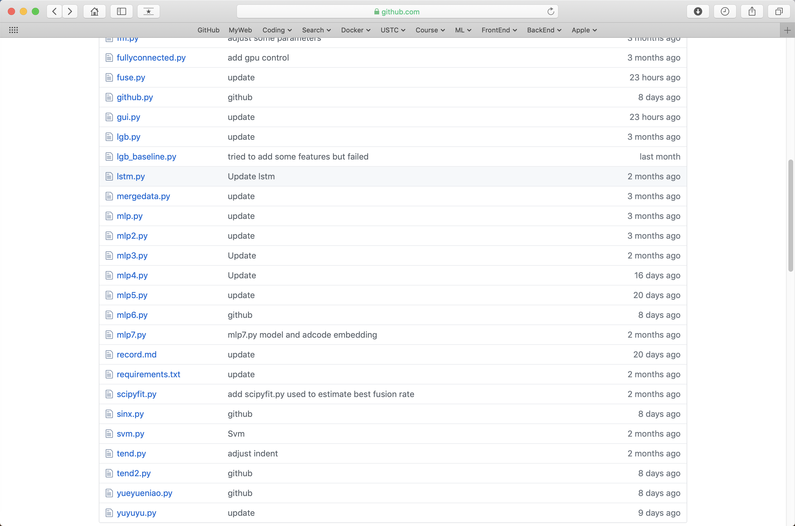

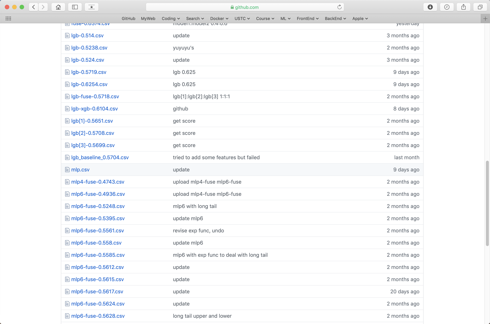

​		唯有这些数据、文件以及提交记录能够见证我们的努力和汗水。

​		最后，感谢队友的辛勤付出，感谢老师、助教以及开源代码的大佬们！


## 五、参考文献

* [https://github.com/ZZZPHOENIX/2019-CCF-BDCI-CarSalesPredict](https://github.com/ZZZPHOENIX/2019-CCF-BDCI-CarSalesPredict)
* [https://blog.csdn.net/weixin_37723489/article/details/102837907](https://blog.csdn.net/weixin_37723489/article/details/102837907)
* [https://blog.csdn.net/weixin_39948381/article/details/101760635](https://blog.csdn.net/weixin_39948381/article/details/101760635)
* [https://discussion.datafountain.cn/questions/1901](https://discussion.datafountain.cn/questions/1901)

